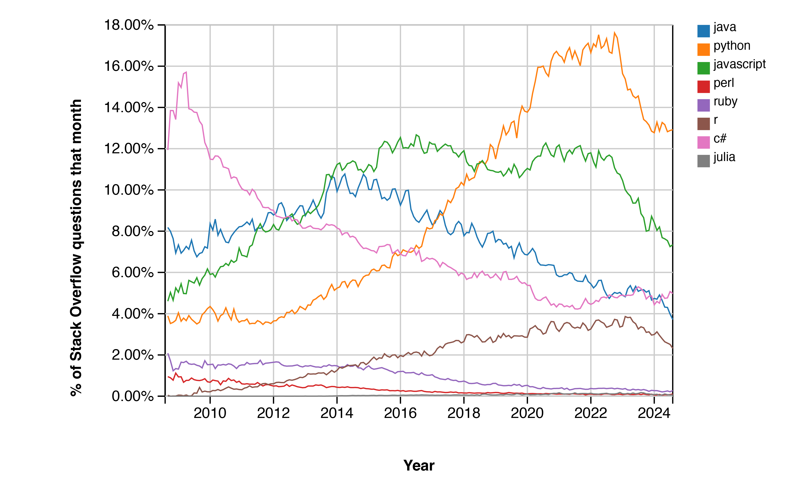

```{r setup, include=FALSE}
knitr::opts_chunk$set(echo = TRUE)
```

# About this presentation
## This presentation was created with R!
Source: https://github.com/holmrenser/r_problems_pitfalls_opportunities

- Primary source code is an Rmarkdown file
- 'Knit' to powerpoint to create a presentation
- Use WUR powerpoint template for consistent styling

__Pros:__ reproducible, transparent, easy code integration

__Cons:__ Not all PPT features, WUR template requires customization to work with Rmd

# R VS Python (Popularity)



# R VS Python (Scope, unique)

:::::: {.columns}
::: {.column}
### R

- Specific, focus on statistics
- Often small standalone analyses
- 'Easy' to perform complex analysis
- RStudio, notebooks
:::

::: {.column}
### Python

- Generic, focus on engineering
- Often used for e.g. pipelines, web services
- 'Easy' to write and debug clean code
- iPython, notebooks
:::
::::::

# R VS Python (Scope, shared)

- Open source software
- Many packages available
- Supported by large user communities
- Straightforward to interface with each other

# R VS Python (Syntax)

:::::: {.columns}
::: {.column}
### R

```{r}
hypotenuse <- function(a,b){ 
  sqrt(a**2 + b**2)
}
col <- c(1,2,3)
for (i in col) {
  print(hypotenuse(i,i))
}
```
:::

::: {.column}
### Python

```{python}
import math
def hypotenuse(a,b):
  return math.sqrt(a**2 + b**2)
col = [1,2,3]
for i in col:
  print(hypotenuse(i,i))
```
:::
::::::

# R VS Python (technical)

:::::: {.columns}
::: {.column}
### R
Vectorized by default
```{r}
a <- c(1,2,3)
b <- c(4,5,6)
a + b
```
:::

::: {.column}
### Python
Needs manual implementation (or e.g. numpy)
```{python}
a = [1,2,3]
b = [4,5,6]
[x+y for x,y in zip(a,b)]
```
:::
::::::

# Some R quirks (1)
Spot the difference!

```{r}
a <- 4
a < 3
```

```{r}
a < -3
```

```{r, results='hide'}
a <-3
a
```

# Some R quirks (1)
Spot the difference!

```{r}
a <- 4
a < 3
```

```{r}
a < -3
```

```{r}
a <-3
a
```

# Some R quirks (2)
```{r, results='hide'}
n <- 2
for (i in 1:n+1) print(i)
```

```{r, results='hide'}
for (i in 1:(n+1)) print(i)
```

# Some R quirks (2)
```{r}
n <- 2
for (i in 1:n+1) print(i)
```

```{r}
for (i in 1:(n+1)) print(i)
```

First version is equal to: `for (i in (1:n)+1) print(i)`

# Operator precedence

In the previous example, operator ':' has precedence over '+'

Another example:
```{r}
10^1:6
```
# Operator precedence

In the previous example, operator ':' has precedence over '+'

Another example:
```{r}
10^1:6
```

```{r}
10^(1:6)
```

Operator '^' has precedence over ':'

# Some R quirks (3)

:::::: {.columns}
::: {.column}
## &
```{r}
x <- 1:3
```
```{r}
x > 1
```
```{r}
x < 3
```
```{r}
x > 1 & x < 3
```
```{r, error=TRUE}
x > 1 && x < 3
```
:::

:::{.column}
## &&
```{r}
y <- 1
z <- 3
y > 1 && z < 3
```
:::
:::::

# Some R quirks (4)
## The pipe operator `|>`
```{r}
c(1,2) |> exp() |> sqrt()
```


- Can be useful for chaining operations, e.g. filtering/cleaning data
- Inspired by magrittr `%>%`
    - 'Ceci n'est pas un pipe' 
    - Implementations differ in subtle ways
- Balance between readability and conciseness

# Debugging (1)
## What is the problem here?
```{r}
data <- read.table('inp.txt')
dim(data)
```

```{r}
data <- read.table('inp.txt', sep=',')
dim(data)
```

# Debugging (2)
:::::{.columns}
:::{.column}
## Numeric data as factor
```{r}
a <- rep(factor(101:103), 2)
a
```
The following does not work as expected:
```{r}
as.numeric(a)
```
:::

:::{.column}
Shortcut: convert to character first
```{r}
as.numeric(as.character(a))
```
```{r}
a |> 
  as.character() |> 
  as.numeric()
```
More efficient (but harder to read)
```{r}
as.numeric(levels(a))[a]
```
:::
:::::

# Debugging (3)
## Not a number?

- __NULL__ represents the null object in R; it is returned by expressions and functions whose values are undefined
- __NA__ is a logical constant which stands for missing value
- __NaN__ applies to numerical 'impossible values'
- __Inf__ result of storing either a large number or dividing by zero

# Debugging tips

__Tip nr. 1__: When R complains, stop!

- Read _and understand_ the error message, use a search engine* if you do not understand it
- Inspect if variables contain what you think they contain - e.g. `print()` intermediate values
- __Isolate small subparts or your code__
- __Test code on a small problem for which you know the solution__
- Use the `browser()` function or the RStudio debugger (insert breakpoints)

# Knitting

- Knitting to PDF directly is often difficult to get to work; knit to word first and then save as PDF
- When you knit again, don't forget to close the previous word file first
- Don't put `install.packages` in RMarkdown
- Default working directory of code blocks is the folder were the Rmd file is located

# BioConductor

- Collection of >2000 bioinformatics packages for analyzing high-throughput data: https://www.bioconductor.org
- Install base package first
```{r, eval=FALSE}
source("https://bioconductor.org/biocLite.R")
biocLite()
```
- Then install BioConductor packages using its own installer
```{r, eval=FALSE}
biocLite("DESeq2")
```
- An overview of BioConductor packages can be found at https://www.bioconductor.org/packages/release/BiocViews.html#___Software/
